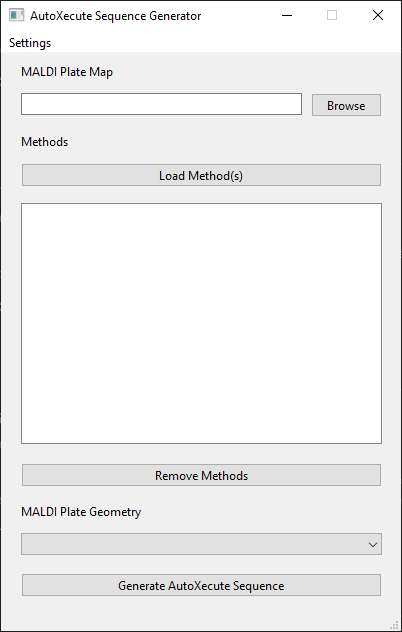
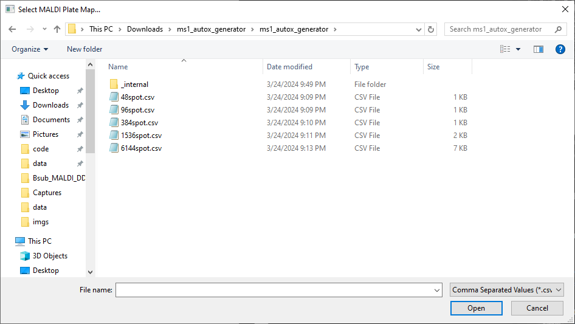
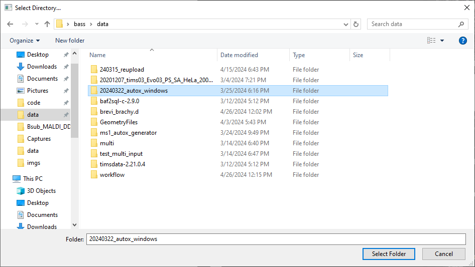
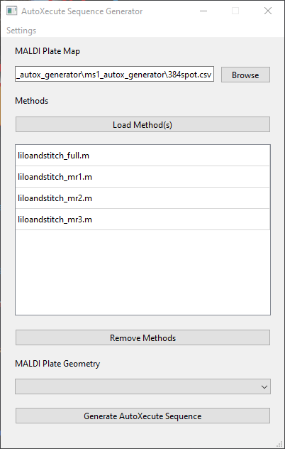
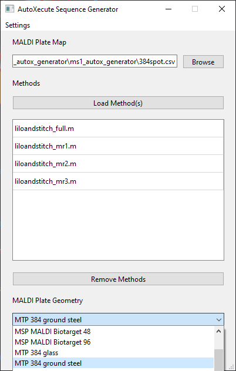
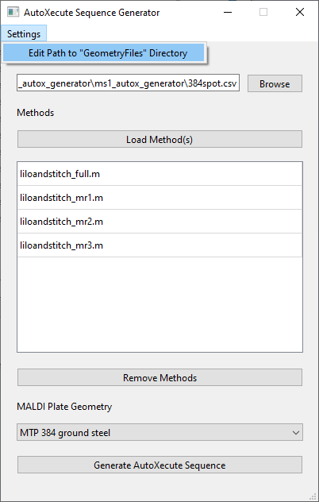
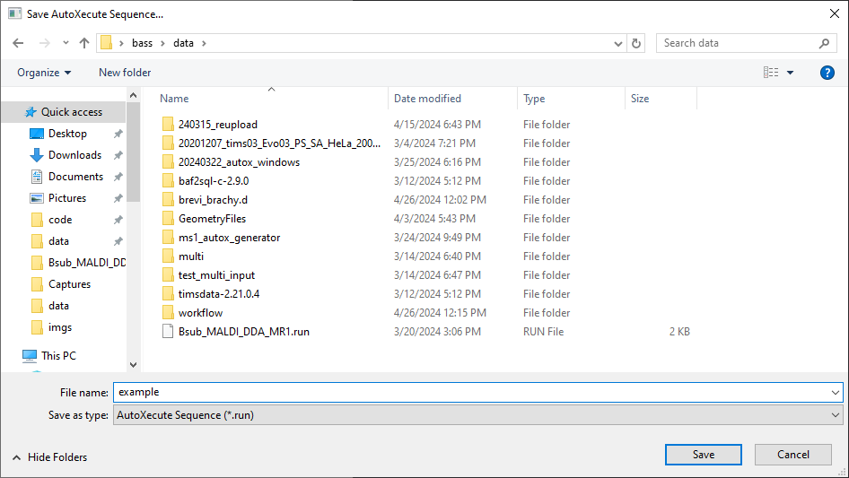

About
=====
fleX MS1 AutoXecute Generator is a tool that allows users to create an AutoXecute sequence for Bruker timsControl in
which multiple methods can be used to acquire data from the same spot to acquire multiple spectra. As an example, users
can acquire data on a full 384 spot plate using a method tuned for lower mass ranges first, followed by a method tuned
for higher mass ranges, all in a single automated run.

Installation
------------
Download from _____, unzip the folder, and run "ms1_autox_generator.exe" to start the program. No other installation
is required.

Usage
-----
Please note that this tool works best when run on the timsTOF fleX acquisition computer.

Once loaded, the main window will be shown, and users will need to load a MALDI plate map, the desired timsControl
acquisition methods to be used, and the MALDI plate geometry being used.

MALDI Plate Map
^^^^^^^^^^^^^^^
A CSV plate map can be selected with sample names can be selected by clicking the ``Browse`` button under
``MALDI Plate Map``, which will create a file selection dialogue window to select a CSV file. This will create
``Spot Groups`` for each sample name in the plate map. For example, if A1, A2, and A3 are named ``strain1``, this will
create a ``Spot Group`` named ``strain1`` that contains those 3 spots. Example plate maps for 24, 48, 96, 384, 1536,
and 6144 format plates are provided.

Methods
^^^^^^^
Similarly, methods can be selected by clicking the ``Load Method(s)`` button, which will open a directory selection
dialogue window to select a method. If a directory that does not end in ``.m`` is selected, all Bruker timsControl
``.m`` methods within that directory and any subdirectories will be selected and added to the table below.

Methods can be removed from the table by clicking on one or more methods listed and clicking the ``Remove Methods``
button below the table.

These methods will be passed on to each ``Spot Group`` obtained from the ``MALDI Plate Map``. Using the above example,
the ``strain1`` ``Spot Group`` will be split into 4 ``Spot Groups`` named ``strain1_liloandstitch_full``,
``strain1_liloandstitch_mr1``, ``strain1_liloandstitch_mr2``, and ``strain1_liloandstitch_mr3``.

MALDI Plate Geometry
^^^^^^^^^^^^^^^^^^^^
Lastly, the appropriate ``MALDI Plate Geometry`` can be selected from the dropdown menu. Note that only plate
geometries using standard microplate formats can be selected.

By default, the geometry names are loaded from the default ``GeometryFiles`` directory found at
``D:\Methods\GeometryFiles``. If no plate geometries are listed in the dropdown menu, the path to ``GeometryFiles`` can
be modified by going to ``Settings`` > ``Edit Path to "GeometryFiles" Directory``.

Bruker timsControl Version
^^^^^^^^^^^^^^^^^^^^^^^^^^
This program will also attempt to detect the current version of Bruker timsControl that is installed. However, if no
installation of timsControl is found, it will default to using hte version of timsControl distributed with Compass
2024b SR1.

Run
^^^
Once all parameters have been loaded, click on ``Generate AutoXecute Sequence`` to open a dialogue window and select
where to save the AutoXecute sequence.

The saved AutoXecute sequence can then be loaded into Bruker timsControl. It is recommended to validate the created
AutoXecute sequence using the ``Validate`` button above the sample list in timsControl.
