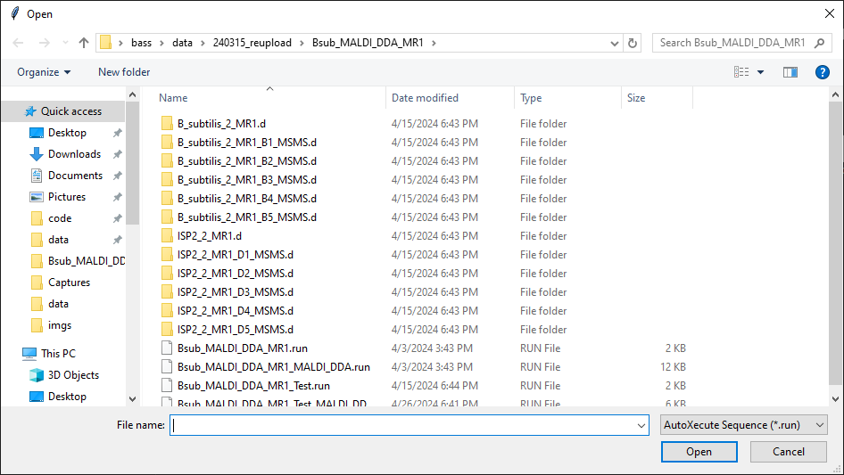
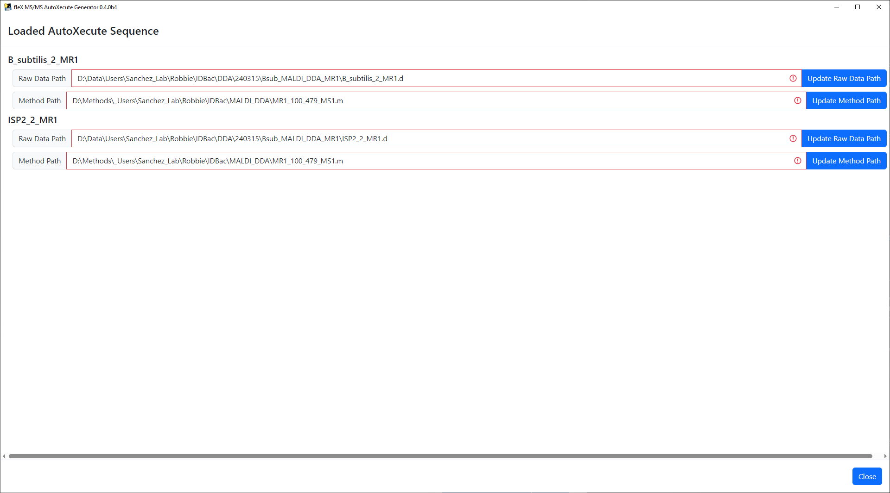

About
=====
fleX MS/MS AutoXecute Generator is a tool that allows for semi-automated precursor selection from MALDI-qTOF dried
droplet MS datasets in a data dependent fashion on the Bruker timsTOF fleX using timsControl. Full scan MS data is
first acquired using standard data acquisition protocols using automation through AutoXecute. Data is the processed
through fleX MS/MS AutoXecute Generator to generate an MS/MS AutoXecute sequence.

Installation
------------
This workflow should be installed and run on the computer used for data acquisition as the resulting AutoXecute
sequence relies on local file paths.

GUI
^^^
The recommended method to run this workflow is via the GUI. To do so, download from _____, unzip the folder, and run
``msms_autox_generator.exe`` to start the program. No other installation is required.

Alternatively, the GUI can be started from the command line, which will require a Python/conda virtual environment that
can be installed by following the command line installation instructions below.

Installing on Windows
^^^^^^^^^^^^^^^^^^^^^
1. Download and install `Anaconda for Windows <https://repo.anaconda.com/archive/Anaconda3-2023.07-2-Windows-x86_64.exe>`_ if not already installed. Follow the prompts to complete installation.

2. Download and install `Git for Windows <https://github.com/git-for-windows/git/releases/download/v2.42.0.windows.2/Git-2.42.0.2-64-bit.exe>`_ if not already installed.

3. Run ``Anaconda Prompt``.

4. Create a conda instance.

   .. code-block::

        conda create -n msms_autox_generator python=3.11

5. Activate conda environment.

   .. code-block::

        conda activate msms_autox_generator

6. Install dependencies.

   .. code-block::

        pip install -r https://raw.githubusercontent.com/gtluu/flex_maldi_dda_automation/gui/requirements.txt

7. Install pyMALDIproc/pyMALDIviz.

   .. code-block::

        pip install git+https://github.com/gtluu/pyMALDIproc.git

8. Install flex_maldi_dda_automation.

    .. code-block::

        pip install git+https://github.com/gtluu/flex_maldi_dda_automation.git --use-pep517

9. Start the fleX MS/MS AutoXecute Generator GUI. See below for usage details.

    .. code-block::

        msms_autox_generator

Installing on Linux
^^^^^^^^^^^^^^^^^^^
1. If not already installed, download and install `Anaconda for Linux <https://repo.anaconda.com/archive/Anaconda3-2023.07-2-Linux-x86_64.sh>`_. Anaconda3-2023.07-2 for Linux is used as an example here.

   * Alternatively, the script can be downloaded in the ``Terminal`` using the following command.

   .. code-block::

        wget https://repo.anaconda.com/archive/Anaconda3-2023.07-2-Linux-x86_64.sh

2. If not already installed, install ``git``. On Ubuntu 23.04.3 LTS, this can be done using the following command.

   .. code-block::

        sudo apt-get install git

3. Install Anaconda for Linux via the bash script that was downloaded. After installation, restart the terminal (or open a new terminal window).

   .. code-block::

        bash [path to]/Anaconda3-2023.07-2-Linux-x86_64.sh

4. In the terminal, create a conda virtual environment.

   .. code-block::

        conda create -n msms_autox_generator python=3.11

5. Activate conda environment.

   .. code-block::

        conda activate msms_autox_generator

6. Install dependencies.

   .. code-block::

        pip install -r https://raw.githubusercontent.com/gtluu/flex_maldi_dda_automation/gui/requirements.txt

7. Install pyMALDIproc/pyMALDIviz.

   .. code-block::

        pip install git+https://github.com/gtluu/pyMALDIproc.git

8. Install flex_maldi_dda_automation.

    .. code-block::

        pip install git+https://github.com/gtluu/flex_maldi_dda_automation.git --use-pep517

9. Start the fleX MS/MS AutoXecute Generator GUI. See below for usage details.

    .. code-block::

        msms_autox_generator

Usage
-----
When starting fleX MS/MS AutoXecute Generator, a file selection dialogue window will appear in which an AutoXecute
sequence can be loaded.

The AutoXecute sequence will be loaded and a window will appear in which the file paths to the raw data and timsControl
acquisition method are validated. If these file paths are found to be invalid, the buttons next to each text box can be
used to update the path to each invalid raw data and method directory. This window cannot be closed until all file
paths are found valid.

Once all file paths have been validated, click ``Close`` and the main flex MS/MS AutoXecute Generator window will be
shown.

.. image:: imgs/msms_autox_generator_03.png
   :alt: Raw Data and Method Path Validation Window

MALDI Plate Map
^^^^^^^^^^^^^^^
At the top of the main window, a plate map is shown based on the plate geometry that was used in the AutoXecute
sequence that was loaded. Note that ony standard microplate format plate geometries are valid in this tool. Below the
plate map, a legend is found for the plate map and buttons to mark a spot as a blank/control spot or to clear the spots
currently marked as a blank/control. Sample spots are colored white in the plate map, blank spots are green, and spots
containing no data are colored gray.

Exclusion List
^^^^^^^^^^^^^^
An exclusion list can be used to exclude features that are not of interest (i.e. known MALDI matrix peaks, features
found in control samples, etc.) from the final precursor lists for each spot during precursor selection. Two options
are provided to populate the exclusion list: 1) generating a list from the blank/control spots as marked on the plate
map, or 2) uploading a list from a user made CSV file.

To generate an exclusion list from blank/control spots, first select and mark one or more spots as a blank using the
``Mark Spots as Blank Button``.

.. image:: imgs/msms_autox_generator_05.png
   :alt: fleX MS/MS AutoXecute Generator Main Window with Blanks

All preprocessing steps and parameters can be modified by clicking the ``Edit Preprocessing Parameters`` button, which
will bring up a new window.

Preprocessing steps can be enabled by clicking on their respective checkbox, and selecting preprocessing methods will
show/hide relevant preprocessing parameters for that step/method.

Once the desired steps have been enabled and parameters have been set, click ``Save`` to apply the desired settings. A
confirmation message will appear.

Once spots have been marked and preprocessing parameters have been set, click on the
``Generate Exclusion list from Blank Spots`` button and the spectra from these spots will be processed to create a
consensus peak list from the mark spots, which will be displayed in the exclusion list table.

.. image:: imgs/msms_autox_generator_09.png
   :alt: fleX MS/MS AutoXecute Generator Main Window with Exclusion List

A button labeled ``View Blank Spectra Used to Generate Exclusion List`` will appear. As its name implies, the processed
blank spectra can be viewed using this button to manually inspect the processed data used to generate the exclusion
list. The spectra shown here is a ``plotly`` figure, making it interactive and allowing for zooming, showing m/z and
intensity information upon hovering on a peak, and saving the plot to a PNG file.

If the preprocessing applied to the blank spectra and resulting exclusion list prove to be unsatisfactory, the
exclusion list can be cleared using the ``Clear Exclusion List`` Button; users can then modify preprocessing
steps/parameters and attempt to generate a new exclusion list until a satisfactory result has been achieved.
Alternatively, if a single feature has been erroneously selected for the exclusion list, that feature can be removed by
clicking on the ``X`` on the left side of the row in the exclusion list table.

To upload an exclusion list, a single column CSV file with the column name ``m/z`` should be created and saved using
the spreadsheet/text editor of choice. Then, click on the ``Upload Exclusion List from CSV`` button to open a file
selection dialogue window to select the created CSV file. Please note that doing so will clear and overwrite any
existing exclusion list that has been generated/uploaded.

.. image:: imgs/msms_autox_generator_11.png
   :alt: Exclusion List File Selection Dialogue Window

Generating an MS/MS AutoXecute Sequence
^^^^^^^^^^^^^^^^^^^^^^^^^^^^^^^^^^^^^^^
Processing parameters can be modified to differ from those used during exclusion list generation (if performed) by
going back to the edit preprocessing parameters window. This window also includes precursor selection parameters,
including how many precursors to select, whether to use the exclusion list, and the Da tolerance to use when comparing
peak lists to the exclusion list. Once all parameters have been set, precursor selection in sample spots can be done by
clicking on the ``Preview Precursor List`` button. This will bring up a preview window where individual spectra from
sample spots can be inspected to view the results of precursor selection before writing the precursors to a new MS/MS
AutoXecute sequence. Like the blank spectra plots, this is an interactive ``plotly`` plot with the same functionality
described above.

.. image:: imgs/msms_autox_generator_12.png
   :alt: Precursor Selection Preview Window

If the precursor list is not satisfactory, the ``Go Back`` button can be used to go back to the main window, where the
processing parameters and/or exclusion list can be modified again.

Once satisfactory precursor selection results have been achieved, click on the ``Generate MS/MS AutoXecute Sequence``
button to proceed. A new window will appear where the output directory for the AutoXecute sequence itself and the
resulting MS/MS dataset that will be acquired. A new timsControl method can also be specified instead of using the
original methods used in the first AutoXecute run.

.. image:: imgs/msms_autox_generator_13.png
   :alt: Generate MS/MS AutoXecute Sequence Settings Window

Please note that for MS/MS data acquisition, timsControl methods do not need to be set to ``MS/MS`` mode explicitly in
timsControl. However, users must ensure that the methods used have a CID Table set up in the MS/MS tab in timsControl
that will be used to extrapolate isolation windows and collision energies for each precursor. Failure to do so may
result in suboptimal MS/MS data or failure to acquire data completely.

Finally, click on the ``Run`` button to save the new MS/MS AutoXecute sequence. A confirmation message will appear
once the file has been successfully saved.

The saved AutoXecute sequence can then be loaded into Bruker timsControl. It is recommended to validate the created
AutoXecute sequence using the ``Validate`` button above the sample list in timsControl.
